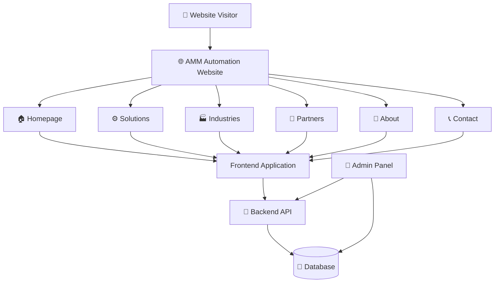
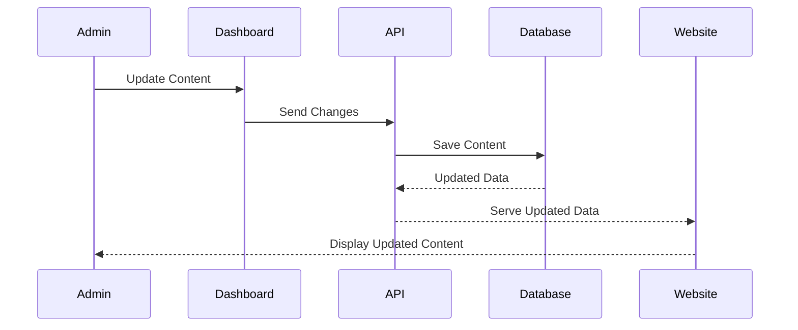

# ⚙️ AMM Automation

<p align="center">
  
</p>

<h3 align="center">
  Industrial Automation • Engineering Solutions • Smart Industrial Systems
</h3>

<p align="center">
  <strong>Modern digital presence for AMM Automation — built to showcase industrial capabilities, solutions, industries, partnerships and company information.</strong>
</p>

<p align="center">
  <a href="https://amm-automation.vercel.app/">
    
  </a>
  
  
</p>

---

## 🌐 Live Website

<p align="center">

### 🚀 [Visit AMM Automation](https://amm-automation.vercel.app/)

</p>

> A modern industrial automation website designed to present AMM Automation's capabilities, solutions, industries served, partner ecosystem and company information through a professional digital experience.

---

# 🏢 About The Project

**AMM Automation** is a modern corporate website created for an industrial automation and engineering company.

The platform provides a structured digital experience where visitors can discover the company's:

* ⚙️ Automation solutions
* 🏭 Industrial capabilities
* 🔧 Engineering services
* 🌐 Industries served
* 🤝 Partner companies
* 📋 Company information
* 📞 Contact and enquiry options

The website focuses on **professional presentation, clear navigation, responsive design and scalable content management**.

---

# ✨ Key Features

<table>
<tr>
<td width="50%">

### 🏠 Modern Homepage

Clean and professional landing page focused on the company's core value proposition.

</td>
<td width="50%">

### ⚙️ Industrial Solutions

Dedicated sections for automation and engineering solutions.

</td>
</tr>

<tr>
<td>

### 🏭 Industry Information

Structured presentation of industries and industrial applications.

</td>
<td>

### 🤝 Partner Ecosystem

Dedicated area for showcasing partner companies and collaborations.

</td>
</tr>

<tr>
<td>

### 📱 Fully Responsive

Optimized for desktop, tablet and mobile devices.

</td>
<td>

### 🎨 Modern UI/UX

Corporate visual language with clean layouts, cards, typography and visual hierarchy.

</td>
</tr>

<tr>
<td>

### 🧭 Structured Navigation

Dedicated pages keep detailed information organized instead of overloading the homepage.

</td>
<td>

### 🚀 Production Ready

Deployed and accessible through Vercel.

</td>
</tr>
</table>

---

# 🖥️ Website Preview

## 🏠 Homepage

<p align="center">
  
</p>

---

## ⚙️ Solutions / Services

<p align="center">
  
</p>

---

## 🏭 Industries

<p align="center">
  
</p>

---

## 🤝 Partners

<p align="center">
  
</p>

---

## 📞 Contact

<p align="center">
  
</p>

---

# 🎯 Design Philosophy

The website follows a **clean industrial-corporate design system**.

### Core principles

```text
Professional
     ↓
Clear Information Architecture
     ↓
Strong Visual Hierarchy
     ↓
Responsive Experience
     ↓
Fast & Scalable Interface
```

The homepage intentionally focuses on **high-level information** while detailed information is maintained inside dedicated sections.

This avoids turning the homepage into an information-heavy documentation page.

---

# 🧩 Website Structure

```text
AMM Automation
│
├── 🏠 Home
│   ├── Hero
│   ├── Company Introduction
│   ├── Key Solutions
│   ├── Capabilities
│   └── Call To Action
│
├── 🏢 About
│   ├── Company Overview
│   ├── Vision
│   └── Mission
│
├── ⚙️ Solutions
│   ├── Automation Solutions
│   ├── Engineering Solutions
│   └── Industrial Services
│
├── 🏭 Industries
│   └── Industry-specific Applications
│
├── 🤝 Partners
│   └── Partner Companies
│
├── 📞 Contact
│   ├── Enquiry
│   ├── Contact Information
│   └── Location
│
└── 🔐 Administration
    └── Content Management
```

---

# 🛠️ Technology Stack

<p align="center">


</p>

### Frontend

* ⚛️ React
* ⚡ Vite
* 🎨 Tailwind CSS / Modern CSS
* 🧩 Component-based architecture
* 📱 Responsive UI

### Backend / Data

* 🟢 Node.js
* 🚂 Express.js
* 🍃 MongoDB
* 🔐 Authentication & authorization
* 🔄 API-based content management

### Deployment

* ▲ Vercel
* 🐙 GitHub
* 🔄 Git-based deployment workflow

---

# 🏗️ Architecture



---

# 🔄 Content Management Flow



---

# 📱 Responsive Experience

The interface is designed to provide a consistent experience across:

| Device      | Experience                     |
| ----------- | ------------------------------ |
| 🖥️ Desktop | Full-width corporate layout    |
| 💻 Laptop   | Optimized content spacing      |
| 📱 Mobile   | Mobile-first responsive layout |
| 📲 Tablet   | Adaptive grid and navigation   |

---

# 🔐 Admin & Content Management

The platform can be structured around an administrative content-management workflow where authorized administrators can manage website information without modifying the frontend manually.

Potential manageable content includes:

```text
├── Company Information
├── Solutions
├── Industries
├── Partner Companies
├── Images
├── Contact Information
└── Homepage Highlights
```

This approach makes the website easier to maintain and scale as the company grows.

---

# 🚀 Deployment

The production website is deployed using **Vercel**.

### Production URL

**https://amm-automation.vercel.app/**

Deployment workflow:

```text
Developer
    │
    ▼
GitHub Repository
    │
    ▼
Git Push
    │
    ▼
Vercel Build
    │
    ▼
Production Deployment
    │
    ▼
🌐 Live Website
```

---

# 💻 Local Development

## 1️⃣ Clone the repository

```bash
git clone <YOUR_GITHUB_REPOSITORY_URL>
cd <PROJECT_DIRECTORY>
```

## 2️⃣ Install dependencies

```bash
npm install
```

## 3️⃣ Start development server

```bash
npm run dev
```

## 4️⃣ Open in browser

```text
http://localhost:5173
```

> If your project uses a different development port, use the port displayed by Vite in the terminal.

---

# 📦 Production Build

Create an optimized production build:

```bash
npm run build
```

Preview the production build locally:

```bash
npm run preview
```

---

# 📁 Recommended Project Structure

```text
amm-automation/
│
├── public/
│   ├── images/
│   ├── logos/
│   └── assets/
│
├── src/
│   ├── components/
│   ├── pages/
│   ├── layouts/
│   ├── sections/
│   ├── hooks/
│   ├── services/
│   ├── utils/
│   └── App.*
│
├── assets/
│   ├── amm-banner.png
│   ├── homepage.png
│   ├── solutions.png
│   ├── industries.png
│   ├── partners.png
│   └── contact.png
│
├── package.json
├── README.md
└── ...
```

---

# 📊 Project Highlights

<p align="center">

| ⚙️ Industrial Focus |   🎨 Modern UI   | 📱 Responsive | 🚀 Production |
| :-----------------: | :--------------: | :-----------: | :-----------: |
|      Automation     | Corporate Design |  All Devices  |     Vercel    |
|     Engineering     |   Clean Layout   |  Mobile Ready |  CI/CD Ready  |

</p>

---

# 🧠 Why This Project?

Traditional industrial company websites often contain large amounts of technical information on a single page.

AMM Automation follows a more structured approach:

```text
                    ┌──────────────────────┐
                    │      HOME PAGE       │
                    │                      │
                    │  Quick Introduction  │
                    │  Key Highlights      │
                    │  Primary Solutions   │
                    │  CTA                 │
                    └──────────┬───────────┘
                               │
              ┌────────────────┼────────────────┐
              ▼                ▼                ▼
        🏭 Industries      🤝 Partners      ⚙️ Solutions
        Detailed Info      Company Info     Detailed Info
```

This creates a better user experience by allowing visitors to quickly understand the company before exploring detailed information.

---

# 📈 Scalability

The project architecture is designed to support future expansion such as:

* 🤖 AI-powered customer assistant
* 📊 Analytics dashboard
* 📝 Online enquiry management
* 📧 Automated email notifications
* 🗂️ Advanced CMS
* 🌍 Multi-language support
* 🔍 Advanced search
* 📱 Progressive Web App capabilities
* 🔐 Advanced admin roles
* ☁️ Cloud-based media management

---

# 🧪 Quality & Performance

The project should be maintained with focus on:

* ✅ Responsive layouts
* ✅ Reusable components
* ✅ Optimized images
* ✅ Semantic HTML
* ✅ Accessible navigation
* ✅ Clean component structure
* ✅ Production builds
* ✅ Secure environment variables
* ✅ Scalable API architecture

---

# 🛡️ Security

For production environments:

* 🔐 Keep API keys inside environment variables
* 🚫 Never commit `.env` files
* 🔑 Protect administrative routes
* 🛡️ Validate API requests
* 🔒 Use secure authentication
* 🌐 Use HTTPS in production
* 🧹 Sanitize user-generated content

Add the following to `.gitignore` where applicable:

```gitignore
node_modules/
.env
.env.local
.env.production
dist/
```

---

# 🤝 Contributing

Contributions, improvements and suggestions are welcome.

```bash
# Fork the repository

# Create a feature branch
git checkout -b feature/your-feature

# Commit your changes
git commit -m "feat: add your feature"

# Push your branch
git push origin feature/your-feature
```

Then open a Pull Request.

---

# 📬 Contact

For business enquiries, partnerships, technical discussions or project-related communication, please use the contact information available on the official website.

<p align="center">

### 🌐 AMM Automation

**Industrial Automation & Engineering Solutions**

<a href="https://amm-automation.vercel.app/">
  
</a>

</p>

---

# ⭐ Project

If you find this project useful or interesting, consider giving the repository a ⭐.

<p align="center">


© 2026 AMM Automation. All Rights Reserved.

</p>
